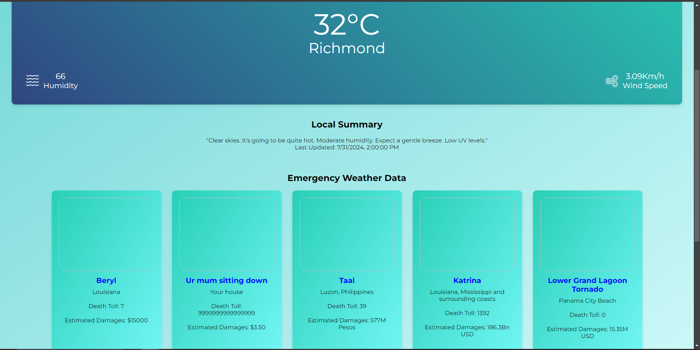

# Disaster Catalogue Backend

## Description
Ever wanted to catalogue the natural disasters nearest and dearest to your heart, so you can really get a feel for the trend of annihilation the world inexorably marches towards? Me too! Here at [REDACTED] inc. we thought it would be just a lovely thing to be able to check up on the weather and see the worst it can do to us, so we made it happen.

## Brief Example

## User Stories
* As a user, I should be able to search the weather conditions in any city in the world.
* As a user, I should be able to see live updates during emergency situations.
* As a user, I should be able to make permanent additions, edits, and deletions to the emergency catalogue.
* As a user, I don't really care about how hideous the backend is as long as it lets the routes and models work correctly and interact with each other

## Technologies Used
* Cors
* Dotenv
* Express
* React
* Mongoose
* Nodemon
* Node Fetch
* Open Weather Map API
* Ambee Data API

## Installation Instructions
Fork or at least clone down the git repo, use your terminal to cd into the backend folder, doing an "npm i" inside of the folder, then enter "nodemon" to get the server up and running.

Then you'll want to recreate a .env file in the backend folder where you must add your own API information.

You can source the free version of the weather city search bar from https://openweathermap.org/. For the main weather summary api key can be retrived on a 14day trial from https://docs.ambeedata.com/. Then you will also want to add your local database repository from MongoDB.

The port can be any unused port really, and you can use any mongo key you like.

## Contribution Guidelines
Honestly anything. This unholy monstrosity is held together with popsicle sticks and elmer's glue. Fork and fiddle with it as you please and we'll probably take whatever you do.

[Abandon all hope ye who click on here](https://github.com/Eightleggedcorgi/project3test)

[Complaints Department](https://github.com/Eightleggedcorgi/project3test/issues)
